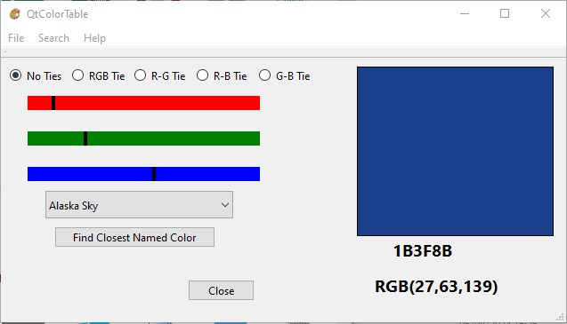

**QtColorTable**

This color aid has been developed with the needs of the coder and/or designer in mind.  Finding just the right color for the purpose can be somewhat guesswork at times.  This utility will, hopefully, provide a means to do this in a simpler fashion.
This app provides a large number of ‘Named’ colors.   As well as the commonly-known ones such as ‘Alice Blue’, ‘Coral’, and ‘Wheat’ there are also some uncommon ones, for example, ‘Pinecone’ or ‘Safety Vest.’
A nice guide to these colors may be found at [https://johndecember.com/html/spec/colorcodes.html](https://johndecember.com/html/spec/colorcodes.html) 

When started the display should appear as:

You may use the **Name** combobox to select a named color.  These are in alphabetical order starting with _Alaska Sky_ and ending with _UNKNOWN_.  UNKNOWN is a placeholder and has no RGB value (not a good idea to select it).  When you select a new name, the RED/GREEN/BLUE sliders will show the positions for that color as well as the color display and the RRGGBB hex value below the color display.

You may also slide any of the three color sliders.  They range from 0 to 255.  When you release the slider, that position will then determine the color display and the RRGGBB value.  If the color is NOT one of the named colors the combobox will show UNKNOWN  (See there was a reason for that ‘name’).   If the box displays UNKNOWN, you may click the **Find Closest Named Color** button and the display will be reset to the named color numerically (RRGGBB) nearest to the slider positions.
